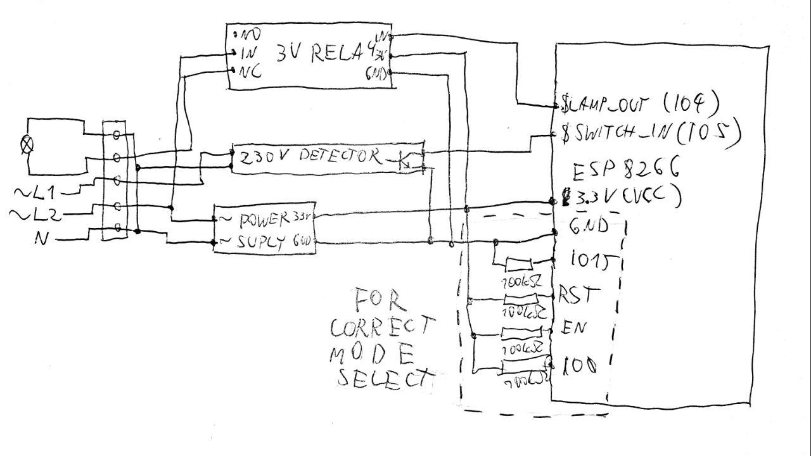
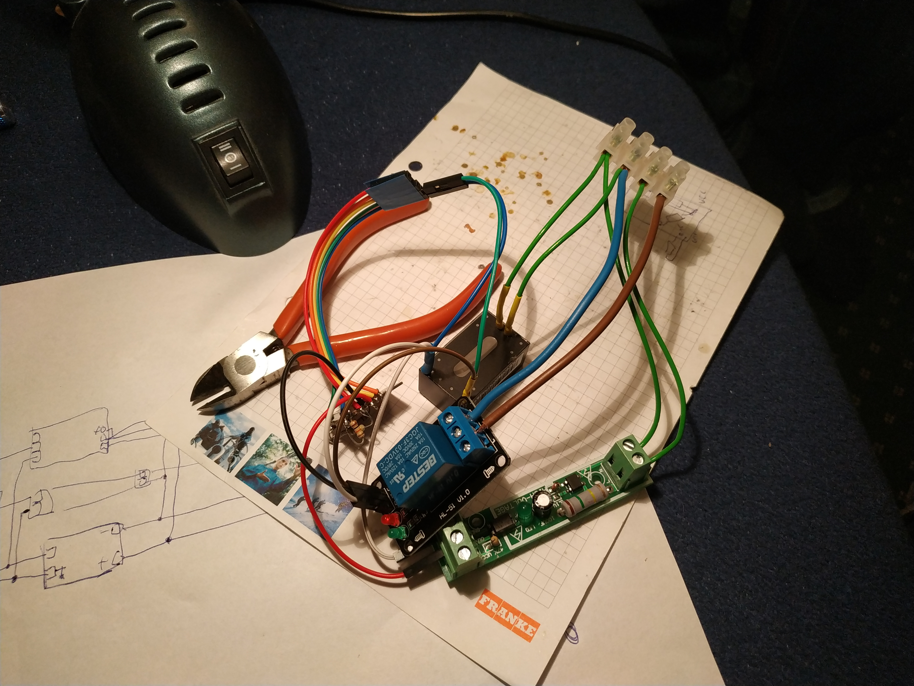
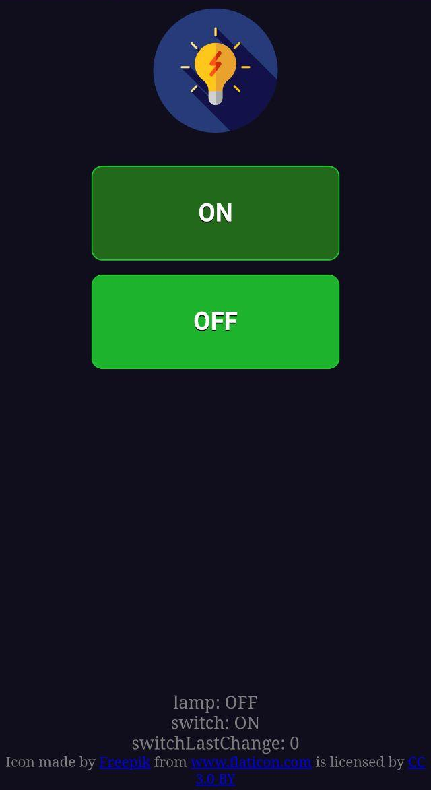

# Simple IOT Light switch with ESP8266

This is a code repository for my lamp switch project. Aim of this project is to provide a simple self contained IOT light solution. 
No central server or cloud is required for operation of my module.
My module is also fails safe. Failure of the module results in the relay staying in closed position allowing for light operation by turing on/off module power supply.

## 

## Hardware components used

- [ESP12-F board (ESP8266)](https://www.aliexpress.com/item/1000001794160.html)
- [3V relay](https://www.aliexpress.com/item/32811523122.html)
- [3.3V power supply](https://www.aliexpress.com/item/32584176181.html)
- [AC power detector](https://www.aliexpress.com/item/32719921989.html)
- Wall switch with 2 controlable outputs

Total price: ~7USD (excluding wall switch)

## Hardware schema



## Building software

To build and install this project:

1. Install Arduino IDE
2. Add `http://arduino.esp8266.com/stable/package_esp8266com_index.json` in Arduino preferences->Extra URLs for Board Manager
3. Install ESP8266 in Board Manager
4. Open the project
5. Copy `config.h.example` to `config.h`
6. Fill configuration parameters in `config.h` file.
7. Build&upload the code to ESP8266.
8. Install `https://github.com/esp8266/arduino-esp8266fs-plugin`
9. Build the SPIFFS image.

To update the running module online see UI->HTTP update. You can aquire SPIFFS file by using "upload spiffs" function of the spiffs plugin. 
It will fail due to missing connection to ESP8266, but in logs you will find the path of build spiffs image.

## UI

### HTTP `/`

Main UI with buttons for controlling the light and status info. No authorizations is provided / authorization has to be handled on network level.

This is a Web Progressive App and works nicely when added to Home Screen on Android.

### HTTP `/update`

Allows for updating app image and SPIFFS image after authorization. See [config](#config)

## API

### GET `/getState`

parameters: none

returns: JSON with current state

example:

```json
{
    "lamp": "ON",
    "switch": "OFF",
    "switchLastChange": 124220188,
    "systemTime": 167513477
}
```

### GET `/setLamp`

parameters:
- (required) lampState - value has to be one off: `ON`, `OFF`, `TOGGLE`

returns: JSON with current state (result of getState)

example:
```bash
$ http "lamp.local/setLamp?lampState=ON" 
HTTP/1.1 200 OK
Connection: close
Content-Length: 87
Content-Type: application/json

{
    "lamp": "ON",
    "switch": "OFF",
    "switchLastChange": 124220188,
    "systemTime": 167647811
}
```

## Results

 

 


